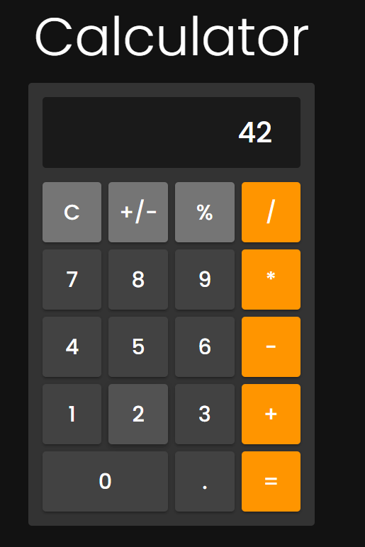

# Calculator

Calculator App which supports addition, subtraction, multiplication, division and modulo operations. Built using React and Go.

To start the client run `npm run start` from the client directory

To start the server run `go run main.go` from the server directory

